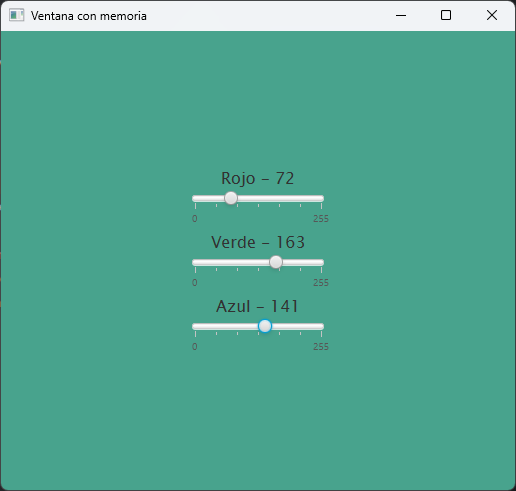

# VentanaConMemoria

A simple program created with javafx that saves the values ​​of Sliders which modify the background color of the program.

To change the background color you only need to move the Sliders to change the color value, with this you can change the color composition using RGB values.

You can also see the exact value in real time when moving the Slider.

## Image

